# Azure Monitor Dashboards

[Azure Monitor Dashboards](https://azuremonitor.io/) is a standalone, performant, real-time dashboarding platform which currently supports ADX and LA as data sources with more (Metrics, AI etc.) to be added in future. Long term goal for Azure Monitoring Dashboard is to be a one-stop solution for all the azure monitoring needs. 

The following image depicts an Azure Monitor Dashboard.
    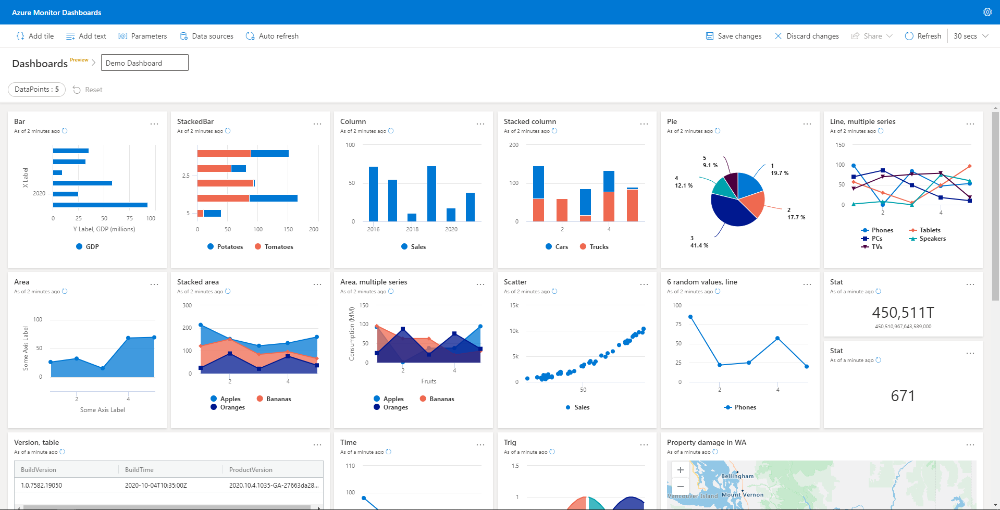

The goal of this page is to quickly get you up and running with the Azure Monitor Dashboards by describing the steps necessary to create a dashboard.

## Prerequisites

### KQL

We assume that you have some familiarity with KQL (Kusto Query Language). If not, you can find a quick tutorial [here](https://docs.microsoft.com/en-us/azure/kusto/query/tutorial?pivots=azuredataexplorer).

## Create a dashboard

1. In the navigation bar, select **Dashboards** and select **New dashboard**.

    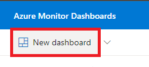

1. Select a dashboard name and **Create**.

    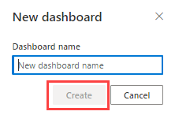

## Add data source

Add the required data sources for the dashboards.

1. Select **Data sources** menu item on the top bar. Select the **+ New data source** button in the **Data sources** pane.

    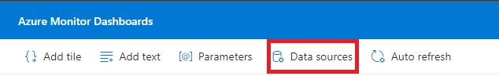

1. In the **Create new data source** pane:
    1. Select the **Data source type**
  For **Azure Data Explorer** data source
        1. Enter the **Cluster URI** or partial name including region and select **Connect**. 
        1. Select the **Database** from the drop-down list.
        1. Use the default or modify the **Data source name**, if needed. 
        1. Select **Apply**.
            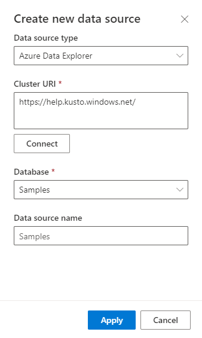

          For **Azure Monitor - Logs** data source
        1. Select a **Subscription** from the drop-down list.
        1. Select a **Resource group** from the drop-down list.
        1. Select a **Workspace** from the drop-down list.
        1. Use the default or modify the **Data source name**, if needed. 
        1. Select **Apply**.
            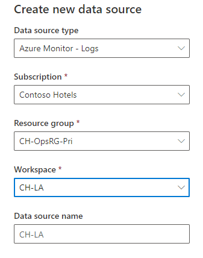

           For **Azure Monitor - Application Insights** data source
        1. Select a **Subscription** from the drop-down list.
        1. Select a **Resource group** from the drop-down list.
        1. Select a **Workspace** from the drop-down list.
        1. Use the default or modify the **Data source name**, if needed. 
        1. Select **Apply**.
            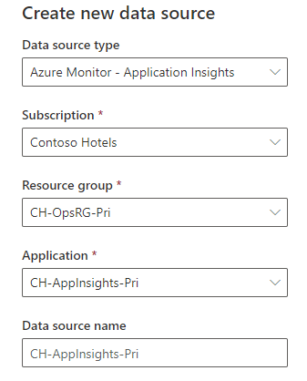

## Use Parameters

Parameters enable using dashboard filters. Parameters significantly improve dashboard rendering performance and enable you to use filter values as early as possible in the query. For more information about using parameters, see [Use parameters in Azure Monitor dashboards](pages/dashboard-parameters.md).

1. Select **Parameters** on the top bar. Select the **+ New parameter** button in the **Parameters** pane.

    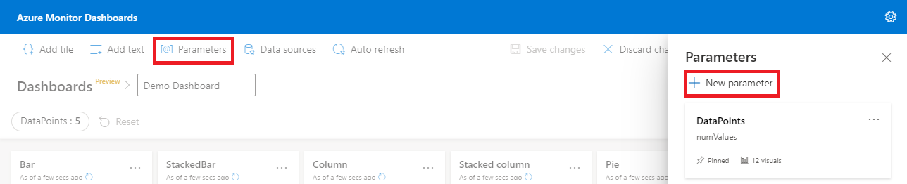

1. Enter values for all the mandatory fields and select **Done**.

    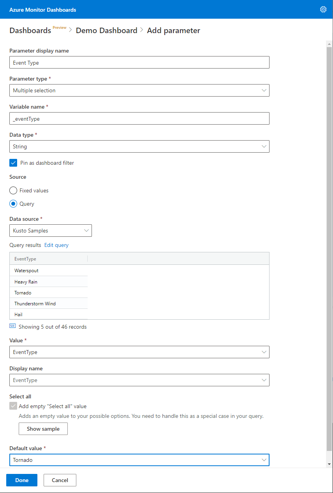

|Field  |Description |
|---------|---------|
|**Parameter display name**    |   The name of the parameter shown on the dashboard or the edit card.      |
|**Parameter type**    |One of the following:<ul><li>**Single selection**: Only one value can be selected in the filter as input for the parameter.</li><li>**Multiple selection**: One or more values can be selected in the filter as input(s) for the parameter.</li><li>**Time range**: Allows creating additional parameters to filter the queries and dashboards based on time.Every dashboard has a time range picker by default.</li></ul>    |
|**Variable name**     |   The name of the parameter to be used in the query.      |
|**Data type**    |    The data type of the parameter values.     |
|**Pin as dashboard filter**   |   Pin the parameter-based filter to the dashboard or unpin from the dashboard.       |
|**Source**     |    The source of the parameter values: <ul><li>**Fixed values**: Manually introduced static filter values. </li><li>**Query**: Dynamically introduced values using a KQL query.  </li></ul>    |
|**Add a “Select all” value**    |   Applicable only to single selection and multiple selection parameter types. Used to retrieve data for all the parameter values.      |

## Add Query

**Add Query** uses Kusto query language snippets to retrieve data and render visuals. Each query can support a single visual.

1. Select **Add Query** from the dashboard canvas or the top menu bar.

    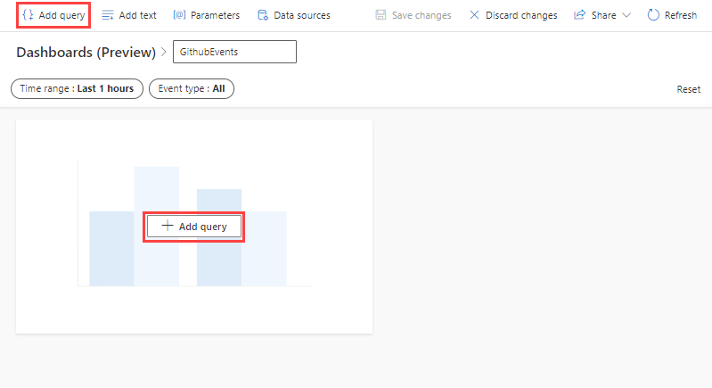

1. In the **Query** pane, 
    1. Select the data source from the drop-down
    1. Type the query, and select **Run** 
    1. Select **+ Add visual**

    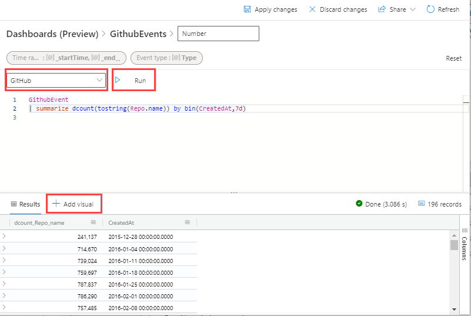

1. In the **Visual formatting** pane, select **Chart type** to choose the type of visual. 
1. Name the visual and select **Apply changes** to pin the visual to the dashboard.

    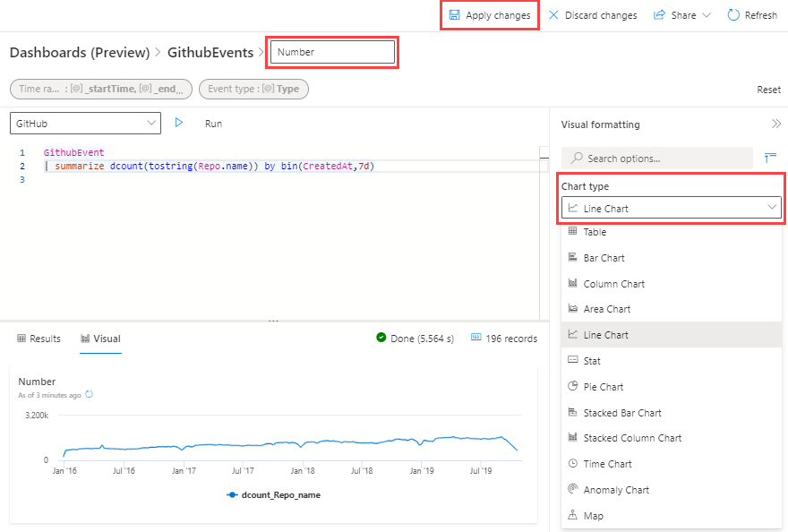

1. You can resize the visual and **Save changes** to save the dashboard.

    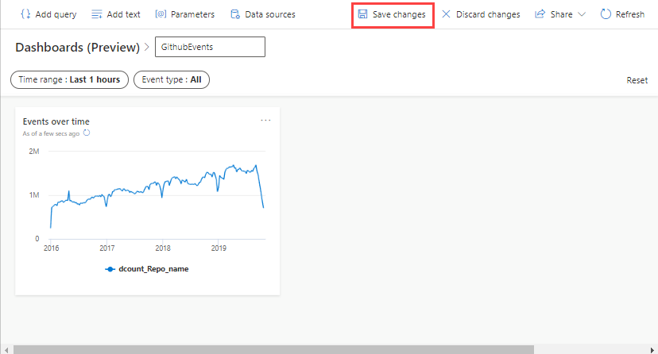

## Organize the dashboards with pages

You can use pages to easily organize the tiles in your dashboards in multiple pages or combine multiple related dashboards into one.

1. Open the **Pages pane** from the left side and select **Add page**.

    

1. Select the **Move tile** option to place a tile on a specific page.

    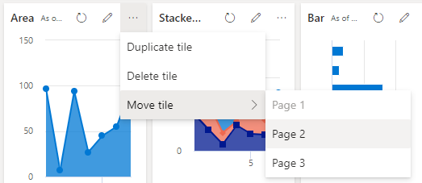

1. Pages can be rearranged easily by dragging them to the correct position.

## Share dashboards

Use the share menu to [grant permissions](#grant-permissions) to the dashboard, [change a user's permission level](#change-a-user-permission-level), and [share the dashboard link](#share-the-dashboard-link).

> [!IMPORTANT]
> To access the dashboard, a dashboard viewer needs the following:
> * Dashboard link for access
> * Dashboard permissions
> * Access to the underlying database/workspace

1. Select the **Share** menu item in the top bar of the dashboard.
1. Select **Manage permissions** from the drop-down. 

    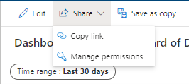

### Grant permissions

To grant permissions to a user in the **Dashboard permissions** pane:
1. Write the user's name or email in **Add new members** box.
1. Select the **Permission** level as **Can view** or **Can edit** and then click **Add**.

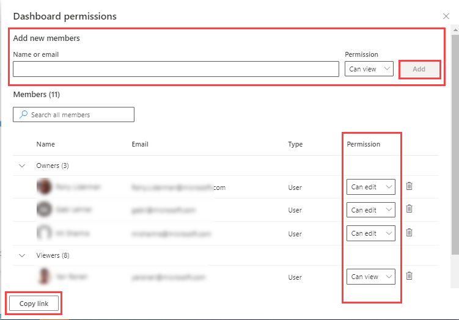

### Change a user permission level

To change a user permission level in the **Dashboard permissions** pane:
1. Use the search box or scroll the user list to find the user.
1. Change the **Permission** level as needed.

### Share the dashboard link

To share the dashboard link:
* Select **Share** drop-down and then select **Copy link**
Or
* In the **Dashboard permissions** window, select **Copy link**. 

## Enable auto refresh 

1. Select **Edit** in dashboard menu to switch to edit mode.
1. Select **Auto refresh**. 
 
    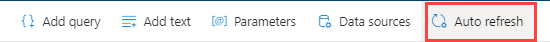

1. Toggle the option so auto refresh is **Enabled**. 
1. Select values for **Minimum time interval** and **Default refresh rate**. 

    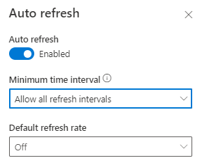

1. Select **Apply** and **Save** the dashboard.

> [!NOTE]
> * Select the smallest minimum time interval to reduce unnecessary load on the cluster. 
> * A dashboard viewer: 
>    * Can change the minimum time intervals for personal use only. 
>    * Can't select a value which is smaller than the **Minimum time interval** specified by the editor.

## Next Steps

* [Use parameters in Azure Monitor dashboards](pages/dashboard-parameters.md)
* [Customize dashboard visuals](pages/dashboard-customize-visuals.md)

## Support or Contact

If you run into trouble or have bugs/ feature requests, please reach out to us here: [Azure Monitor Dashboard Support](mailto:azmondbdsup@microsoft.com) and we’ll help you sort it out.
